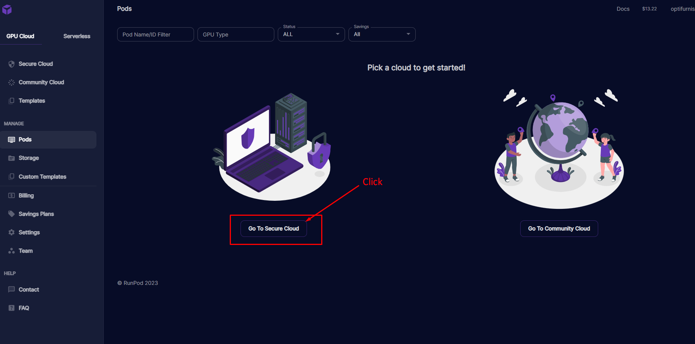
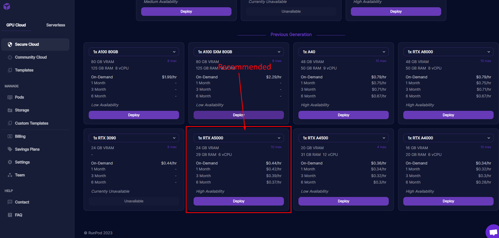
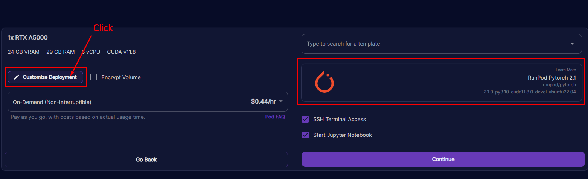
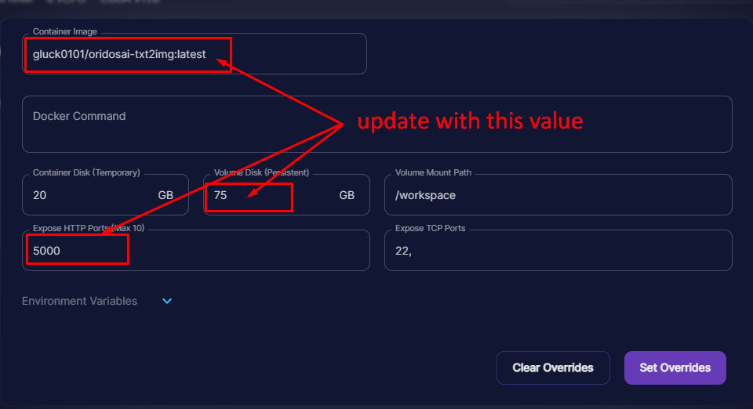
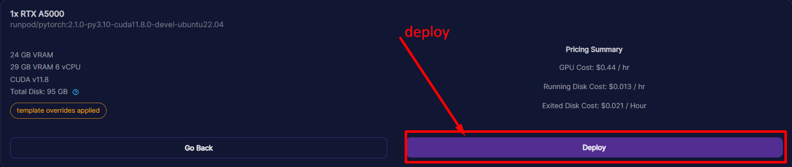
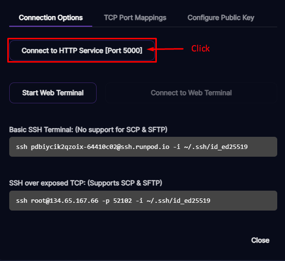
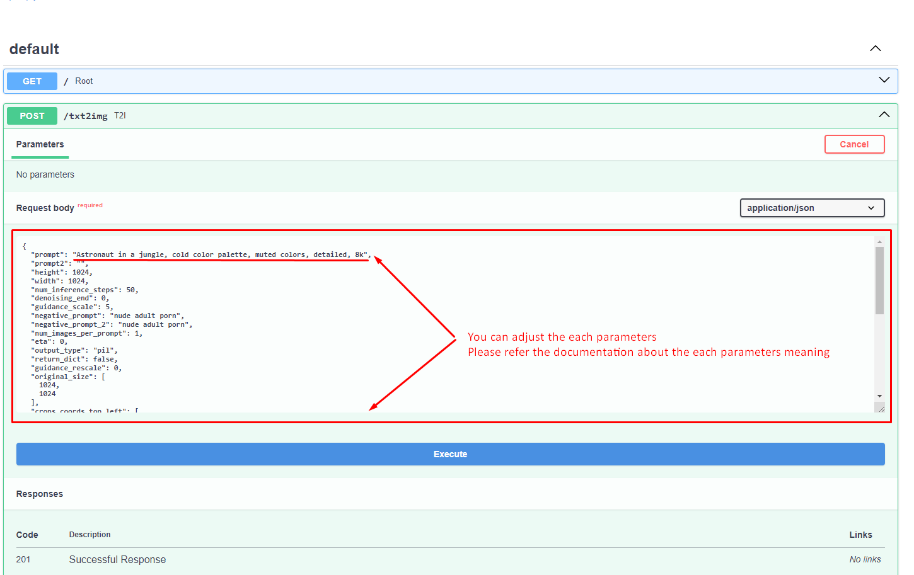
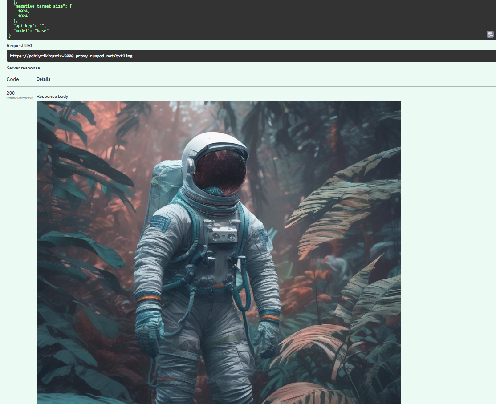
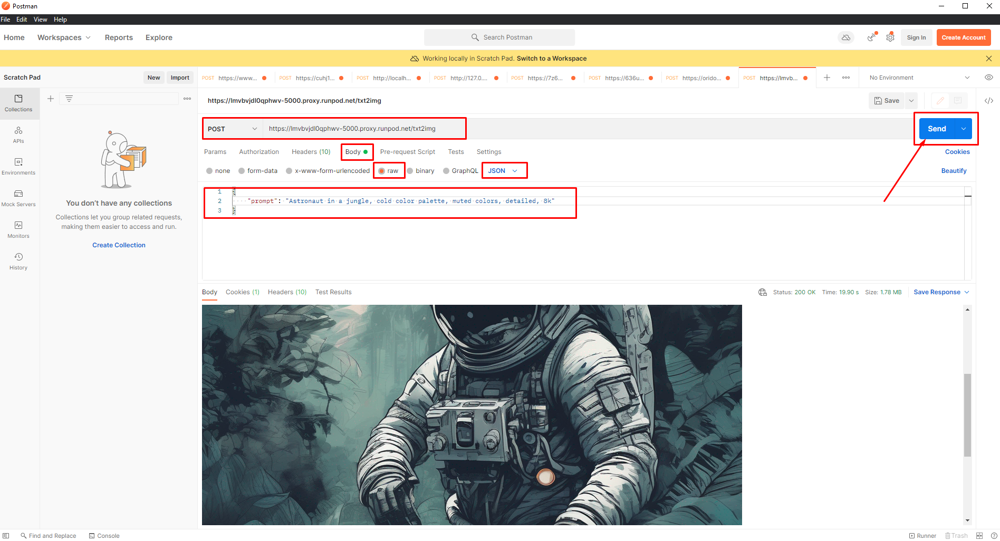

# 1. When use my docker hub image.

### docker hub: gluck0101/oridosai-txt2img:latest  
### https://hub.docker.com/repository/docker/gluck0101/oridosai-txt2img  











Did you follow me here?  
You can see the results after a while. It may take a while to create the first image. It takes time to download a 12GB model.  
Speed will improve from the second creation onwards.  
Done!  



## You can also use postman.


### Runpod
port 5000
capacity 75GB

# 2. Manual installation
### 2.1. For the first time install docker-compose (NOT docker-compose-plugin)
```bash
sudo apt-get update
sudo apt-get install docker-compose
```

### 2.2. Remove all stopped containers, all networks not used by at least one container, all dangling images, and all dangling build cache 
```bash
./docker_cleanup.sh
```

### 2.3. Clone repository
```bash
git clone https://github.com/oridosai/txt2img-sdxl-p1.git
cd txt2img-sdxl-p1
```
```bash
git pull --all
git merge --strategy=recursive --strategy-option=ours --no-ff origin/dev
```

### 2.4. Make sure to change the image name in docker-compose.yml and Makefile to your Docker Hub image.


### 2.5. Build docker image
```bash
make build
```

### 2.6. Push the docker image to your docker Hub
```bash
make push
```

### 2.7. Then follow the steps in section 1.

### If you want, run locally run
#### use localhost:5000
```bash
make up
```

# Notes:
## num_inference_steps is 10 ~ 30
## num_inference_steps: dpmpp_sde_k, ddim recommend 10 ~ 15, unipc, dpmpp_2m_k recommend 20 ~ 30
## If you set scheduler_name = "" empty string, it will use base model only
