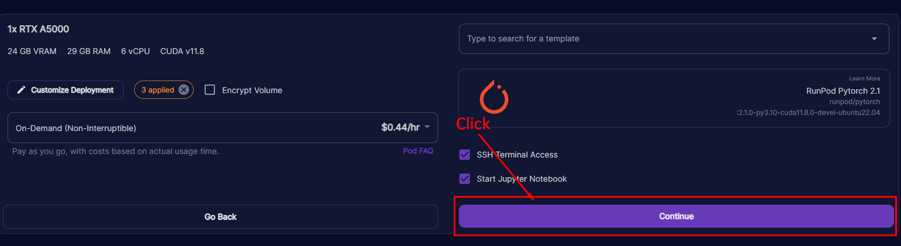
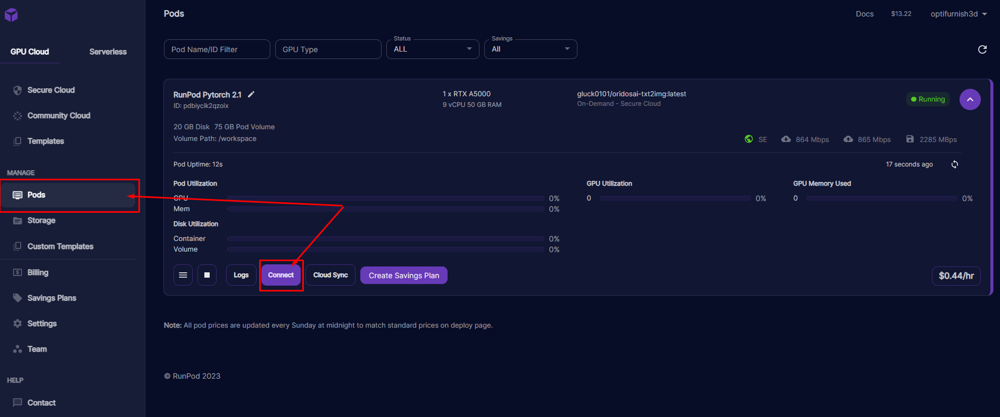
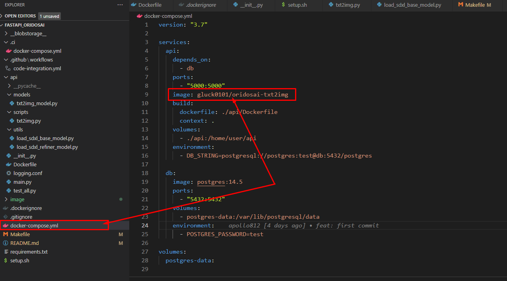

# 1. When use my docker hub image.

### docker hub: gluck0101/oridosai-txt2img:latest  
### https://hub.docker.com/repository/docker/gluck0101/oridosai-txt2img  

Did you follow me here?  
You can see the results after a while. It may take a while to create the first image. It takes time to download a 12GB model.  
Speed will improve from the second creation onwards.  
Done!  

## You can also use postman.

# 2.
``git clone https://github.com/oridosai/txt2img-sdxl-p1.git``
``cd txt2img-sdxl-p1``

### Please change the image to your Docker Hub image.

``make build``
``make push``

### Then follow the first section.

### If you want, run locally run
``make up``
